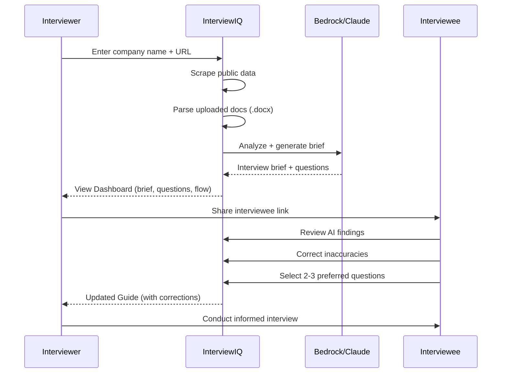

# InterviewIQ — AI-Powered Interview Intelligence System

> **Texas A&M Hackathon 2026** | [Live API](https://l8xc3yrptf.execute-api.us-west-2.amazonaws.com/dev/health) | AWS-Powered

InterviewIQ transforms interview preparation by using AI to analyze company data and generate personalized interview briefs. Interviewers get tailored questions and conversation flows; interviewees get a chance to review and correct AI findings before the interview begins.

---

## 🏗 Architecture

```
┌─────────────────────────────────────────────────────────────┐
│                    AWS AMPLIFY (Frontend)                   │
│           React + Vite • Dark Theme • 4 Routes              │
│  ┌──────────┐ ┌──────────────┐ ┌──────────┐ ┌───────────┐   │
│  │ HomePage  │ │  Dashboard   │ │ Portal   │ │   Guide   │  │
│  │ (input)   │ │ (interviewer)│ │(interviewee)│ (final)  │  │
│  └─────┬─────┘ └──────┬───────┘ └────┬─────┘ └─────┬─────┘  │
└────────┼───────────────┼──────────────┼──────────────┼──────┘
         │               │              │              │
         ▼               ▼              ▼              ▼
┌─────────────────────────────────────────────────────────────┐
│                  API GATEWAY (REST, /dev)                   │
│  POST /pipeline  GET /sessions/{id}  POST /sessions/{id}/fb │
│  POST /sessions  POST /scrape  POST /parse  POST /analyze   │
│  POST /generate  GET /health                                │
└────────────────────────────┬────────────────────────────────┘
                             │
         ┌───────────────────┼───────────────────┐
         ▼                   ▼                   ▼
┌────────────────┐ ┌─────────────────┐ ┌─────────────────┐
│ STEP FUNCTIONS │ │  9 LAMBDA FNs   │ │  LAMBDA LAYER   │
│ interview-iq-  │ │ (Python 3.13)   │ │ shared-deps v2  │
│ pipeline       │ │                 │ │ ┌─────────────┐ │
│                │ │ create_session  │ │ │ shared/     │ │
│ CreateSession  │ │ get_session     │ │ │  bedrock    │ │
│ ↓              │ │ scrape_company  │ │ │  comprehend │ │
│ ParallelGather │ │ parse_document  │ │ │  dynamo     │ │
│  ├ Scrape      │ │ analyze_company │ │ │  s3         │ │
│  └ Parse       │ │ generate_brief  │ │ │  scraper    │ │
│ ↓              │ │ submit_feedback │ │ │  textract   │ │
│ Analyze        │ │ start_pipeline  │ │ │  response   │ │
│ ↓              │ │ health          │ │ └─────────────┘ │
│ GenerateBrief  │ │                 │ │ + pip deps:     │
│ ↓              │ │                 │ │  requests       │
│ Complete       │ │                 │ │  beautifulsoup4 │
│                │ │                 │ │  python-docx    │
└────────────────┘ └─────────────────┘ └─────────────────┘
         │                   │
         ▼                   ▼
┌────────────────┐ ┌─────────────────┐ ┌─────────────────┐
│   DynamoDB     │ │      S3         │ │    Bedrock       │
│ Sessions Table │ │ Documents       │ │ Claude 3.5       │
│ PK: sessionId  │ │ Briefs          │ │ Sonnet           │
│ SK: createdAt  │ │ Scraped Data    │ │                  │
└────────────────┘ └─────────────────┘ └─────────────────┘
```

---

## 🚀 Quick Start

### Prerequisites
- Node.js 18+
- Python 3.13+
- AWS CLI v2 (`brew install awscli`)
- SAM CLI (`brew install aws-sam-cli`)
- AWS credentials configured

### Clone & Run Frontend
```bash
git clone https://github.com/RockGTR/InterviewIQ.git
cd InterviewIQ/frontend
npm install
npm run dev
# → http://localhost:5173
```

### Deploy Backend
```bash
# Configure AWS credentials
aws configure

# Build and deploy
cd backend
sam build
sam deploy --stack-name interview-iq --region us-west-2 \
  --resolve-s3 --capabilities CAPABILITY_IAM CAPABILITY_AUTO_EXPAND \
  --no-confirm-changeset
```

---

## 📁 Project Structure

```
InterviewIQ/
├── backend/
│   ├── template.yaml              # SAM infrastructure-as-code
│   ├── samconfig.toml              # SAM deployment config
│   ├── functions/                  # Lambda handlers (1 per endpoint)
│   │   ├── health/handler.py       # GET  /health
│   │   ├── create_session/         # POST /sessions
│   │   ├── get_session/            # GET  /sessions/{id}
│   │   ├── scrape_company/         # POST /scrape
│   │   ├── parse_document/         # POST /parse
│   │   ├── analyze_company/        # POST /analyze
│   │   ├── generate_brief/         # POST /generate
│   │   ├── submit_feedback/        # POST /sessions/{id}/feedback
│   │   └── start_pipeline/         # POST /pipeline, GET /pipeline/{id}
│   ├── shared/                     # Service modules (in Lambda Layer)
│   │   ├── bedrock_service.py      # Amazon Bedrock / Claude API
│   │   ├── comprehend_service.py   # Amazon Comprehend NLP
│   │   ├── dynamo_service.py       # DynamoDB CRUD operations
│   │   ├── s3_service.py           # S3 file operations
│   │   ├── scraper_service.py      # Web scraping + mock fallback
│   │   ├── textract_service.py     # .docx + PDF text extraction
│   │   └── response_helpers.py     # API Gateway response formatting
│   ├── layers/shared/              # Lambda Layer build
│   │   ├── requirements.txt        # pip dependencies
│   │   ├── Makefile                # Build: pip deps + shared/ modules
│   │   └── python/shared/          # Shared modules for Layer
│   ├── statemachine/               # Step Functions ASL
│   │   └── interview_pipeline.asl.json
│   └── data/
│       └── mock_companies.json     # 5 pre-loaded company profiles
├── frontend/
│   ├── src/
│   │   ├── App.jsx                 # Router: 4 routes
│   │   ├── index.css               # Design system (dark theme)
│   │   ├── pages/                  # HomePage, Dashboard, Portal, Guide
│   │   ├── components/             # Header, Layout
│   │   └── services/api.js         # API client
│   └── amplify.yml                 # AWS Amplify build spec
└── .gsd/                           # GSD methodology tracking
```

---

## 🔗 API Reference

**Base URL:** `https://l8xc3yrptf.execute-api.us-west-2.amazonaws.com/dev`

| Method | Endpoint | Description |
|--------|----------|-------------|
| `GET` | `/health` | System health check |
| `POST` | `/sessions` | Create new interview session |
| `GET` | `/sessions/{sessionId}` | Get session data |
| `POST` | `/scrape` | Scrape company info from web |
| `POST` | `/parse` | Parse uploaded document (docx/PDF) |
| `POST` | `/analyze` | Run NLP analysis (Comprehend) |
| `POST` | `/generate` | Generate interview brief (Bedrock) |
| `POST` | `/sessions/{sessionId}/feedback` | Submit interviewee corrections |
| `POST` | `/pipeline` | Start full end-to-end pipeline |
| `GET` | `/pipeline/{executionId}` | Check pipeline status |

### Example: Health Check
```bash
curl -s https://l8xc3yrptf.execute-api.us-west-2.amazonaws.com/dev/health | python3 -m json.tool
```
```json
{
  "status": "healthy",
  "service": "InterviewIQ",
  "version": "1.0.0",
  "config": {
    "table_name": "interview-iq-sessions-interview-iq",
    "bucket_name": "interview-iq-docs-143643339510-us-west-2",
    "model_id": "anthropic.claude-3-5-sonnet-20241022-v2:0",
    "bedrock_region": "us-east-1"
  }
}
```

---

## 🔄 Interview Workflow



---

## 🛠 Development

### Local Frontend Dev
```bash
cd frontend && npm run dev
```

### Backend: SAM Local Invoke
```bash
cd backend
sam build
sam local invoke HealthFunction
```

### Redeploy After Changes
```bash
cd backend
sam build && sam deploy --no-confirm-changeset
```

### Update Lambda Layer (after changing shared/)
```bash
# Copy updated modules to layer
cp backend/shared/*.py backend/layers/shared/python/shared/
# Rebuild and deploy
cd backend && sam build && sam deploy --no-confirm-changeset
```

---

## 👥 Team

Built for the **Texas A&M AWS Hackathon 2026**.

---

## 📋 AWS Resources

| Resource | Name | Type |
|----------|------|------|
| API | InterviewIQ-API | API Gateway REST |
| Table | interview-iq-sessions-interview-iq | DynamoDB |
| Bucket | interview-iq-docs-143643339510-us-west-2 | S3 |
| Pipeline | interview-iq-pipeline | Step Functions |
| Layer | interview-iq-shared-deps:2 | Lambda Layer |
| Stack | interview-iq | CloudFormation |
| Region | us-west-2 | Oregon |
